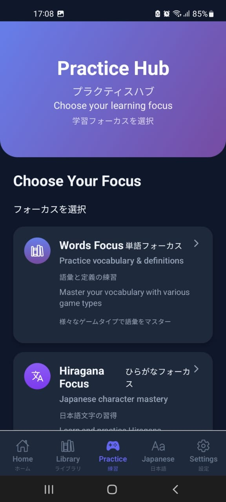

# 🎌 OusaroTeacher (オウサロティーチャー)

A comprehensive Japanese learning app built with React Native and Expo, designed to help users master Japanese vocabulary, Hiragana, Katakana, and numbers efficiently.


##  Features

###  Dashboard & Library
- **Smart Dashboard**: Quick actions and recent added words.
- **Word Library**: Comprehensive vocabulary management with search and filtering
- **Recent Words**: Quick access to your latest additions
- **Favorites System**: Mark and organize your important words


###  Japanese Character Learning
- **Hiragana Mastery**: Complete Hiragana character set with pronunciations and examples
- **Katakana Practice**: Full Katakana alphabet with interactive learning
- **Number System**: Japanese numerals from basic to advanced (1-10,000)
- **Interactive Character Grid**: Touch any character to see details, pronunciation, and examples


###  Practice Modes
Multiple engaging practice modes to reinforce your learning:

#### Vocabulary Practice
- **Word Flashcards**: Tap to reveal definitions with audio pronunciation
- **Matching Game**: Match terms with their meanings quickly
- **Spelling Master**: Perfect your spelling with audio guides
- **Quick Quiz**: Test your vocabulary knowledge

#### Character Practice
- **Hiragana Study**: Learn characters with examples and pronunciation
- **Katakana Study**: Master Katakana with interactive exercises
- **Character Quiz**: Multiple choice character recognition
- **Number Practice**: Learn Japanese counting and number systems




###  Personalization & Settings
- **Theme Options**: Light and dark mode support
- **Backup & Restore**: Never lose your progress with data backup


##  Technology Stack

- **Framework**: React Native with Expo SDK 53
- **Navigation**: React Navigation 7
- **Database**: SQLite for local data storage
- **UI/UX**: 
  - Expo Linear Gradient for beautiful gradients
  - React Native Animatable for smooth animations
  - Custom themed components
- **Performance**: Optimized for mobile with lazy loading and data optimization
- **TypeScript**: Full TypeScript support for type safety

##  Installation

### Prerequisites
- Node.js (v16 or higher)
- npm or yarn
- Expo CLI
- Android Studio (for Android development)
- Xcode (for iOS development, macOS only)

### Setup
1. Clone the repository:
```bash
git clone https://github.com/ousaro/ousaroTeacher.git
cd ousaroTeacher
```

2. Install dependencies:
```bash
npm install
```

3. Start the development server:
```bash
npm start
```

4. Run on your preferred platform:
```bash
# For Android
npm run android

# For iOS
npm run ios

# For web
npm run web
```


## Key Components

### Character Learning
- **Complete Hiragana Set**: All 71 basic Hiragana characters
- **Complete Katakana Set**: All 71 basic Katakana characters
- **Japanese Numbers**: Comprehensive number system (0-10,000)
- **Pronunciation Guide**: IPA notation for accurate pronunciation
- **Example Words**: Real Japanese words for each character

### Vocabulary Management
- **Word Creation**: Add custom words with definitions, translations, and notes
- **Tagging System**: Organize words with custom tags
- **Search & Filter**: Find words quickly with advanced filtering
- **Import/Export**: Backup and share your vocabulary lists

## Features Highlights

- **Bilingual Support**: Japanese and English throughout the app
- **Offline Capable**: Works without internet connection
- **Responsive Design**: Optimized for all screen sizes
- **Accessibility**: Support for screen readers and accessibility features
- **Performance Optimized**: Smooth animations and fast loading times


##  License

This project is licensed under the MIT License - see the [LICENSE](LICENSE) file for details.

---

##  Screenshots

| Home Screen | Library | Practice | Alphabet |
|-------------|---------|----------|----------|
|  |  |  |  |


---

**Start your Japanese learning journey today with OusaroTeacher! 🎌**

*頑張って！(Good luck!)*
